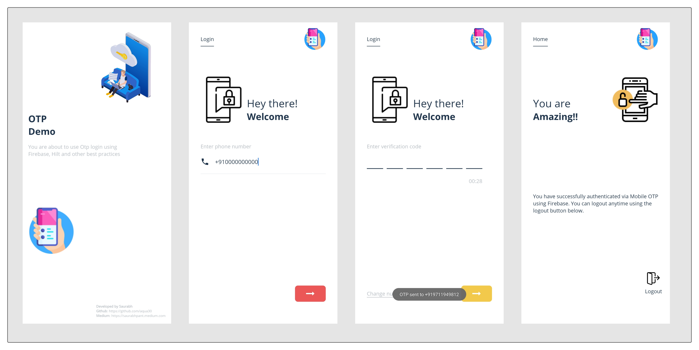

# Otp Demo
A learning project which focuses on designing an OTP flow using Firebase.

Article: https://saurabhpant.medium.com/otp-login-using-firebase-hilt-jetpack-components-all-together-in-kotlin-718f7c6974aa

## Components used
- **Firebase** for sending and verifying otp 🔥
- **Hilt** for Dependency injection 💉
- **Data binding** for view binding 🔖
- **MVVM** architecture 🪕
- **Lifecycle components** ViewModels and Live Data 🧩
- **Shared Animation** for making the transition related and smooth
- **Structured** resources

## Design
The design of the app is kept as simple and accessible as possible. It does what exactly it needs to do.
The most important part is the flow seems to be a single screen throughout. This makes user experience better.

## Purpose
This project focuses majorly on following aspects
1. Designing UI and UX in very simple and clear way
2. Using the best practices to make UI smooth
3. Using all the latest versions of libraries at the moment of writing this
4. Clean code

https://user-images.githubusercontent.com/4559525/129440341-33970c94-6ea9-4156-8c1d-5e9a4baee7be.mp4
